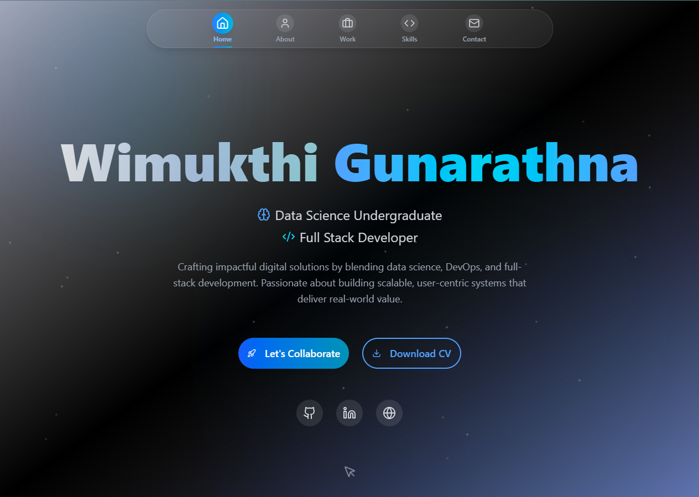

# 🚀 Wimukthi Gunarathna - Portfolio

<div align="center">



**A modern, responsive portfolio showcasing my journey as a Full-Stack Developer**

[](https://nextjs.org/)
[](https://www.typescriptlang.org/)
[](https://tailwindcss.com/)
[](https://www.framer.com/motion/)

[🌐 Live Demo](https://your-portfolio-url.com) • [📧 Contact Me](mailto:your-email@gmail.com)

</div>

---

## ✨ Features

🎨 **Modern Design** - Clean, minimalist interface with smooth animations  
📱 **Responsive Layout** - Optimized for all devices and screen sizes  
⚡ **Fast Performance** - Built with Next.js 14 and optimized for speed  
🎭 **Interactive Elements** - Engaging animations powered by Framer Motion  
🧩 **Component-Based** - Modular architecture with reusable components  
🌙 **Smooth Navigation** - Seamless scrolling and section transitions  

## 🛠️ Tech Stack

### Frontend
- **Framework**: Next.js 14 (App Router)
- **Language**: TypeScript
- **Styling**: Tailwind CSS
- **Animations**: Framer Motion
- **Icons**: Lucide React
- **Components**: Custom UI components with shadcn/ui

### Development
- **Package Manager**: npm/yarn/pnpm
- **Linting**: ESLint
- **Code Quality**: TypeScript strict mode

## 🚀 Quick Start

### Prerequisites
- Node.js 18+ 
- npm, yarn, pnpm, or bun

### Installation

1. **Clone the repository**
   ```bash
   git clone https://github.com/Wimukthi316/Portfolio-New.git
   cd Portfolio-New
   ```

2. **Install dependencies**
   ```bash
   npm install
   # or
   yarn install
   # or
   pnpm install
   ```

3. **Run the development server**
   ```bash
   npm run dev
   # or
   yarn dev
   # or
   pnpm dev
   # or
   bun dev
   ```

4. **Open your browser**
   Navigate to [http://localhost:3000](http://localhost:3000) to see the portfolio

## 📁 Project Structure

```
src/
├── app/
│   ├── globals.css       # Global styles and CSS variables
│   ├── layout.tsx        # Root layout component
│   └── page.tsx          # Main portfolio page
├── components/
│   ├── ui/              # Reusable UI components
│   ├── ClientOnly.tsx   # Client-side rendering wrapper
│   └── top-nav.tsx      # Navigation component
└── lib/
    └── utils.ts         # Utility functions

public/
├── PortfolioIMG.png     # Hero section image
└── wg-logo.svg          # Portfolio logo
```

## 🎯 Sections

- **🏠 Hero** - Eye-catching introduction with animated elements
- **👨‍💻 About** - Personal story and professional journey
- **💼 Work** - Featured projects and achievements
- **🛠️ Skills** - Technical expertise and tools
- **📞 Contact** - Ways to get in touch

## 🎨 Customization

### Colors & Theme
The portfolio uses a sophisticated color scheme defined in `globals.css`. You can customize:
- Primary and secondary colors
- Background gradients
- Text colors
- Border styles

### Content
Update your personal information in:
- `src/app/page.tsx` - Main content and projects
- `src/app/layout.tsx` - Meta information and SEO

### Images
Replace the portfolio image:
- Add your images to the `public/` directory
- Update image references in components

## 🚀 Deployment

### Vercel (Recommended)
1. Push your code to GitHub
2. Connect your repository to [Vercel](https://vercel.com)
3. Deploy with zero configuration

[](https://vercel.com/new?utm_medium=default-template&filter=next.js&utm_source=create-next-app&utm_campaign=create-next-app-readme)

### Other Platforms
- **Netlify**: Perfect for static deployments
- **GitHub Pages**: Free hosting for personal portfolios
- **Railway**: Full-stack deployment platform

## 🔧 Scripts

```bash
npm run dev          # Start development server
npm run build        # Build for production
npm run start        # Start production server
npm run lint         # Run ESLint
```

## 📈 Performance

- ⚡ **Lighthouse Score**: 95+
- 🎯 **Core Web Vitals**: Optimized
- 📱 **Mobile-First**: Responsive design
- 🔍 **SEO Ready**: Meta tags and structured data

## 🤝 Contributing

Feel free to fork this project and make it your own! If you find any issues or have suggestions:

1. Fork the repository
2. Create a feature branch
3. Commit your changes
4. Push to the branch
5. Open a Pull Request

---

<div align="center">

**Built with ❤️ by [Wimukthi Gunarathna](https://github.com/Wimukthi316)**

⭐ Star this repo if you found it helpful!

</div>
